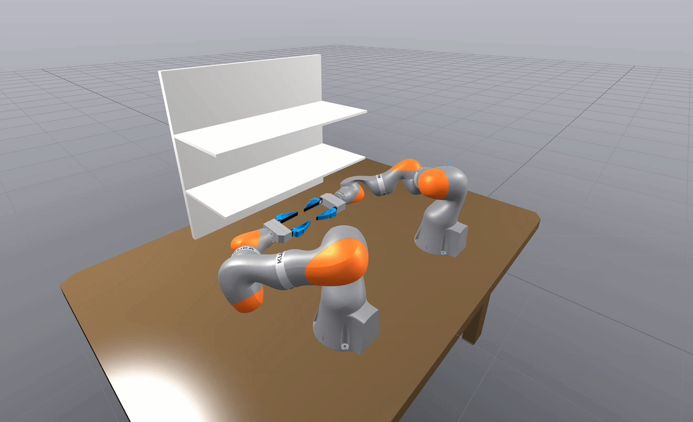

# Bimanual IIWA

The **KUKA IIWA bimanual experiment** for *Planning along Differentiable Charts of Constraint
Manifolds with General-Purpose IK Solvers*. It produces three of the paper's results: the
**downstream runtime table** comparing gradient strategies across a full planning pipeline, the
**low-level accuracy/runtime comparison** between forward-mode autodiff and the Implicit Function
Theorem, and the **swept-volume figure**.

It builds on
[`constrained-bimanual-planning-example`](https://github.com/cohnt/constrained-bimanual-planning-example),
our tutorial repository for constrained bimanual planning.



---

## The idea

Two IIWA-14 arms hold an object with a **fixed relative transform between their end effectors**. That
is a kinematic equality constraint on the 14-DOF configuration. Instead of carrying it as a
constraint, we *eliminate* it: analytic inverse kinematics writes the full configuration as a
function of 8 parameters,

```
q_tilde = [ q_controlled (7 joints) , psi (1 self-motion angle) ]
```

where `psi` is the elbow-swivel angle of the subordinate arm ([the degrees of freedom are illustrated
here](./other/degrees_of_freedom.jpg)). This is a **chart** on the constraint manifold, and every
trajectory expressed in it satisfies the bimanual constraint *by construction*.
IRIS, GCS, RRT, trajectory optimization, and TOPPRA all run in this 8-dimensional space, and results
are mapped back to 14 dimensions through the chart.

The paper's question is how to **differentiate** that chart, especially near singularities where the
subordinate arm's IK is ill-conditioned. Two answers are implemented here:

- **Forward-mode autodiff** straight through the closed-form IK. Accurate and fast, but only
  available because this particular robot happens to have a closed-form solution.
- **The Implicit Function Theorem (IFT)**, which differentiates the constraint rather than the
  solution and so needs no closed form — generalizing to robots where none exists. The cost is that
  singular points must be handled explicitly, and the repository implements five strategies for
  doing so.

The experiments measure what that generality costs.

---

## Installation

This experiment compiles a C++ extension against Drake, so it needs a Drake **installation**
carrying `lib/cmake/drake/drake-config.cmake` — the pip wheel is not one. Follow route 2 or 3 of
[`../docs/INSTALL.md`](../docs/INSTALL.md), which also explains the pybind11 ABI trap that a
mismatched `pydrake` produces. This release is pinned to **Drake 1.56.0**.

```bash
export DRAKE_INSTALL_DIR=/opt/drake                 # from ../docs/INSTALL.md
export PYTHONPATH="$DRAKE_INSTALL_DIR/lib/python3.12/site-packages:$PYTHONPATH"

python3.12 -m venv .venv && . .venv/bin/activate
pip install -r requirements.txt   # deliberately does NOT install drake -- see the file

cmake -S cpp_parameterization/cpp -B cpp_parameterization/build \
      -DCMAKE_PREFIX_PATH=$DRAKE_INSTALL_DIR -DOPTIMIZED_BUILD=ON
cmake --build cpp_parameterization/build -j$(nproc)
```

This writes the Python extension `_iiwa_ik*.so` directly into
`cpp_parameterization/python/iiwa_ik/`. **Every script and test here imports it**, so rebuild after
any C++ change — a stale `.so` silently benchmarks the old behaviour.

`OPTIMIZED_BUILD=ON` enables the optimization flags the paper's numbers were measured with. Do not
add `-march=native`: it breaks Eigen alignment against pybind11.

Python dependencies are in [`requirements.txt`](requirements.txt). All commands below are run
**from this folder** (`iiwa-bimanual/`).

> **On Mosek.** Drake sends the conic solves (IRIS-NP2's inscribed ellipsoid, and the GCS
> relaxations) to Mosek when a licence is present and to Clarabel otherwise. Both work; the
> reported timings were measured with Mosek, so they will differ without it. One test —
> `scripts/tests/test_pipeline_integration.py::test_pipeline_smoke` — does require Mosek, because
> it sets `configuration_space_margin = 0` and Clarabel rejects the resulting region. The
> experiments themselves run either way. See [`../docs/INSTALL.md`](../docs/INSTALL.md).

> A container with all three experiments already built is available — see
> [`../docs/DOCKER.md`](../docs/DOCKER.md).

### Tests

Run both suites before trusting any number. They are the regression net for the differentiation work.

```bash
ctest --test-dir cpp_parameterization/build --output-on-failure   # 232 tests
python3 -m unittest discover scripts/tests                        # 25 tests
```

---

## Reproducing the paper's results

### 1. The downstream runtime table

For each of 17 configurations — a gradient strategy paired with a reachability formulation — this
runs IRIS-NP2 → GCS → RRT + shortcutting → kinematic trajectory optimization → TOPPRA, and records
the runtime **and the outcome** of every stage.

```bash
python3 scripts/experiments/run_full_comparison.py --num-rrt-trials 10   # ~1-1.5 hours
python3 scripts/analysis/plot_pipeline_comparison.py
```

Results are written to `out/timing_<short_name>.json` (one per configuration) plus the aggregate
`out/timing_results_full_comparison.json`. The analysis script prints the table and writes plots to
`out/plots/pipeline_comparison/`.

> **Check the row count.** `out/` is gitignored, and `--skip-existing` reuses whatever per-configuration
> JSON it finds. A partial or stale `out/` therefore produces a *correct-looking* table with the wrong
> rows. Move previous results aside before a new run rather than merging into them. The analysis
> script warns if it does not find exactly 17 configurations, but the warning is easy to scroll past.

Absolute runtimes are machine- and build-dependent; a spread of 20–30% from hardware alone is normal.
**The ratios between rows are the reproducible quantity**, not the absolute seconds.

### 2. The low-level autodiff vs. IFT comparison

Samples 10,000 reachable configurations and measures the error and runtime of both differentiation
methods as a function of the number of partial derivatives carried.

```bash
python3 scripts/experiments/run_gradient_study.py    # ~10 minutes
python3 scripts/analysis/plot_gradient_study.py
```

Writes `out/gradient_study_results.csv`, and figures to `out/plots/gradient_study/`. Note this study
deliberately uses a different IK branch and a tighter `clipping_margin_psi` than the benchmark above;
both are set at the top of the script.

### 3. Deriving the boundary-reachability parameters

The boundary reachability constraint has three parameters. They are **derived from the robot's
kinematics**, and reproducing them is part of reproducing the results:

```bash
python3 scripts/analysis/calibrate_boundary_threshold.py   # prints tau, epsilon, L
```

On this setup it reports `L = 1.8607 m` (the maximum `|p_ee|` over the joint-limit box, used to scale
the angular Jacobian rows so `det(J J^T)` is unit-coherent), and `tau = 2.46` from a velocity
amplification argument (`sigma* = v_task / qdot_max`, with `v_task = 0.1 m/s` and
`qdot_max = 1.309 rad/s`). `epsilon = 1e-6` is bracketed between the median `sigma_min^2` (1.3e-2)
and the float floor (3.1e-15).

> **Never tune `boundary_threshold` or `boundary_epsilon` against planning success rate.** The
> constraint is an inequality `b <= tau`, so any search rewarded for downstream success drives `tau`
> upward until the constraint stops constraining anything. A previously shipped value of 60.0
> rejected 0% of unreachable samples.

Two optional sensitivity studies: `scripts/experiments/run_damping_sweep.py` (IFT damping parameters,
direct reachability only) and `scripts/experiments/run_boundary_sweep.py` (`tau` sensitivity). The
boundary sweep writes to `out/boundary_sweep/`, kept separate from the main benchmark's `out/` so
the two cannot overwrite each other — override with `BOUNDARY_SWEEP_OUT_DIR` if you want it
elsewhere.

### 4. The swept-volume figure

A chronophotography-style still of the bimanual motion: five poses along one trajectory drawn in a
single image at uniform opacity, spaced along the path the arms travel.

**From a fresh clone, one command, no Drake required:**

```bash
python3 scripts/figures/render_swept_volume.py     # -> out/figures/swept_volume_225.png
```

That is the whole reproduction path. Everything it needs is committed: the input trajectory
(`data/swept_volume_trajectory.html`), the Blender add-on (`../third_party/meshcat_html_importer`,
installed into Blender's extension directory on first run), and every framing, lighting and sampling
constant. The only thing not in the repo is Blender itself. **This half of the pipeline does not
import pydrake**, so the figure can be re-rendered on a machine with no Drake install and no compiled
extension — you do not need to build anything or run the notebook first.

```bash
# all five orbits, about half a minute each
for az in 90 135 180 225 270; do
    python3 scripts/figures/render_swept_volume.py --camera-azimuth $az
done

# fast preview while tuning framing
python3 scripts/figures/render_swept_volume.py --samples 48 --resolution 1200 1030
```

The output filename carries the azimuth, so the orbits do not overwrite each other.

The pipeline is **Drake → Meshcat static HTML → Blender → Cycles**, the same route used for the
paper's other experiment figures. Composing in 3-D rather than by 2-D compositing means occlusion
between the ghost poses, the shelves and the table is physically correct.

Two prerequisites:

- **Blender 5.0.x.** Found via `$BLENDER`, then `~/opt/blender-5.0.1-linux-x64/blender`, then
  `blender` on `PATH`.
- **The `meshcat_html_importer` add-on**, vendored at `../third_party/meshcat_html_importer` and
  installed into Blender's extension directory on first run. Verify with
  `python3 scripts/figures/install_meshcat_importer.py --check`, which exits non-zero if the
  installed copy has drifted from the vendored one.

The input is a Meshcat static page. The default, `data/swept_volume_trajectory.html`, is **committed
on purpose**: the notebook's own `notebooks/trajectory.html` is gitignored scratch that a clone does
not have, and it is rewritten with a different trajectory on every stochastic planning run, so the
published figure would not be reproducible from it. To render a newly planned trajectory instead, run
`notebooks/main_cpp.ipynb` end to end — its last cell writes `trajectory.html` via
`meshcat.StaticHtml()` — and pass it with `--html`. The script will not silently substitute a
different scene: a missing or unreadable input is a hard error.

Defaults worth knowing, all overridable:

| Flag | Default | Why |
| --- | --- | --- |
| `--resolution` / `--samples` | 2800x2400 / 128 | The 7:6 aspect matches what the frustum fit actually needs; the camera prints `fill=(x, y)` and a value well under 1.0 on either axis means that much of the frame is empty and the aspect wants changing. What cleared the graininess was the 0.004 adaptive threshold, not the sample count — against a 1024-sample reference, even 128 samples differ by a mean 0.5/255. Pass `--samples 256` for headroom. About a minute on an RTX 3080. |
| framing | arms, bases, shelf | The camera solves the frustum exactly rather than fitting a bounding sphere, which on a subject this elongated left most of the frame empty. The table is rendered but not framed to — it is far wider than the motion and its legs run to the floor. |
| `--pose-nudge` | pose 4 by −0.10 | Per-pose adjustment to where along the path each pose is taken, in fractions of arc length. This is how one pose gets moved without hand-placing it — it still comes off the trajectory, just from a different point on it. Pose 4 sat 27 mm below the final pose while the gap below it was 0.21 m; pulling it back gives 0.491 / 0.619 / 0.730 across the top three. Note the gripper rises monotonically here, so earlier is lower. |
| `--table-material` / `--shelf-material` | `old-metal` / `old-plywood` | BlenderKit asset slugs, appended from your **own** BlenderKit cache (`~/blenderkit_data/materials`), which is not part of this repo. If the asset is not there the script warns and falls back to the procedural `steel_material` / `wood_material`, so a fresh checkout still renders — just plainer. Drake's shelf panels have no UV layer at all, so the restyled objects get a world-space box projection first (`box_project_uvs`); without it an image-textured material has nothing to sample. |
| `--n-poses` | 6, minus one dropped | Two arms overlap heavily; 8 reads as mush. |
| `--drop-poses` | pose 1 | Removes whole poses by index while leaving the rest exactly where they were — lowering `--n-poses` would re-space all of them instead. Pose 1's gripper sat 49 mm above pose 0's, so the two read as one clump at the bottom. Five poses are drawn. |
| `--spacing` | `arclength` | The trajectory is TOPPRA-retimed and then held for a ~1 s settling tail (`AdvanceTo(end_time + 1.0)`), so sampling uniformly in time bunches the poses at both ends. Spacing them along the path the geometry actually travels reads evenly, and gives the tail no weight — which is why `--t-end` can stay at 1.0. |
| `--mid-bias` | 0.35 | The poses are spaced along the path, then pushed together through the middle of the motion. At the start and the end the two arms nearly coincide, so poses spent there only add clutter; 0 is plain even spacing, 0.6 merges the two middle poses. |
| `--alpha` | 0.45 | Uniform across every pose. A per-pose ramp made the opacity read as an artifact rather than a cue; `--endpoint-alpha` opts back into solid endpoints. |
| `--static-tol` | 1e-4 m | Links that never move over the window — the two `iiwa_link_0` bases bolted to the table — are drawn once, opaque, instead of ghosted. Stacking coincident copies z-fights and multiplies alpha, which is what speckled and darkened the bases. |
| `--ambient` / `--world-strength` | 0.45 / 0.35 | The world splits on `Is Camera Ray`: the camera sees the dark navy backdrop at `--world-strength`, while the geometry is lit by a much brighter neutral dome at `--ambient`. One Background node cannot do both — raising it to fill the shadows also floats the figure on a grey field. |
| key-to-fill ratio | near flat | The key lands near-normal on the topmost arm and that side of the shelf; rendering the four sources one at a time, it accounted for every clipped pixel in frame and the other three for none. It is deliberately no stronger than the fills, and the materials carry no metallic — the flat shelf panels and grey arm shells are painted steel and plastic, not mirrors. `--light-strength` scales the whole rig. |
| `--ghost-shadows` | `last` | Only the final pose casts. With `all`, each pose is dimmed by the ones in front of it, which reads as uneven opacity rather than as depth. |
| background | transparent | `film_transparent` is on by default, so the figure drops into the paper over the page rather than in a box of its own colour. `--opaque-bg` renders the navy backdrop instead; the ambient dome lights the scene either way. |
| `--camera-azimuth` | 225° | Picked by contact sheet. See the view table below. |
| `--device` | `auto` | GPU where there is one, Cycles on the CPU where there is not. Naming a backend (`--device OPTIX`) makes its absence a hard error rather than a silent fallback. |

The shelf unit sits at +x from the arms, which rules out a whole half of the orbit: from anywhere
near +x its back panel fills the frame and hides the motion. The five views that work:

| Azimuth | View |
| --- | --- |
| 90° | Side, from +y. Shelf at the left, arms reaching into it across the frame. |
| 135° | Three-quarter, arms between the camera and the shelf. Poses overlap heavily from here. |
| 180° | Back, from −x. Symmetric; the arch of the bimanual motion reads most clearly. |
| **225°** | Three-quarter, the default. Both arms stay distinct and the shelf falls behind and to the side. |
| 270° | Side, from −y. Mirror of 90°. |

315° and 45° are the two that do not work.

Other table materials that read well, if `old-metal` is not the look you want: `rusted-steel-plate` (much rustier), `metal-scratched`, `steel-scratched-and-smudged`, `black-steel`, `gun-metal`. Download them in Blender's BlenderKit panel first, then pass the slug.

> **Licensing:** `data/swept_volume_trajectory.html` embeds the iiwa and WSG mesh geometry, which is not covered by this project's MIT licence — see [`THIRD_PARTY.md`](THIRD_PARTY.md). The paper's rendered PNGs are **not** redistributed here: they are derived works of BlenderKit materials whose per-asset licence is not recorded in the downloaded `.blend`. Rendering them yourself from your own BlenderKit cache is fine; `--table-material procedural --shelf-material procedural` renders using only code from this repository.

**On the CPU this is slow but correct.** The figure is stacked semi-transparent geometry, and what
makes that composite properly is Cycles' `transparent_max_bounces`; EEVEE has no equivalent, so
falling back to it would not be a faster render of the same image but a different image. `--engine
EEVEE` is available explicitly if you want the speed and accept that.

### Hyperparameters

So a run can be checked against ours:

| Parameter | Value |
| --- | --- |
| IK branch (`shoulder_up`, `elbow_up`, `wrist_up`) | `(True, True, False)` |
| `grasp_distance` | 0.6 m |
| `clipping_margin`, `clipping_margin_psi` | 1e-4 |
| `boundary_threshold` (τ) / `boundary_epsilon` (ε) / `boundary_length_scale` (L) | 2.46 / 1e-6 / 1.86 m |
| λ: LM Constant / Newton | 1e-5 |
| LM SVT (`svt_epsilon`, `svt_lambda_max`) | 0.01, 0.005 |
| λ: Residual Std / Residual Aniso | 10.0 |
| IRIS-NP2 | `max_iterations=1`, `epsilon=delta=0.01`, `relax_margin=True`, seed ellipsoid radius 1e-2 |
| GCS | `order=2`, `h_min=0.1`, `h_max=100` |
| TOPPRA | `max_iter=2`, `min_points=200` |

---

## Repository layout

| Path | Contents |
| --- | --- |
| `cpp_parameterization/cpp/iiwa_ik/` | The C++ core: analytic IK, the 8→14 chart, its derivatives, constraints, and costs. See [its README](./cpp_parameterization/README.md). |
| `cpp_parameterization/python/iiwa_ik/` | Thin Python wrapper re-exporting the compiled module. |
| `scripts/experiments/` | The benchmarks and parameter studies. |
| `scripts/analysis/` | Table/plot generation and the boundary-parameter derivation. |
| `scripts/tests/` | Python test suite. |
| `scripts/figures/` | The swept-volume figure pipeline: a driver, a script that runs inside Blender, and the add-on installer. |
| `src/` | Pure-Python support: the reference analytic IK, RRT, shortcutting, and the shared reachability bounds. |
| `models/` | Robot and scene assets. The scene used throughout is `models/old_shelves.dmd.yaml`. |
| `notebooks/main_cpp.ipynb` | An annotated walkthrough of the whole pipeline, running the IFT path. The readable entry point. |
| `out/` | All generated results. Gitignored — results are reproducible artifacts, not repository content. |
| `../third_party/` | Vendored `meshcat_html_importer` Blender add-on, pinned to upstream v0.1.3, shared with the RB-Y1 experiment. See [its README](../third_party/README.md). |

Scripts on the reproduction path: `run_full_comparison.py`, `run_gradient_study.py`,
`calibrate_boundary_threshold.py`, `plot_pipeline_comparison.py`, `plot_gradient_study.py`.

---

## Implementation notes

**Two configuration structs govern everything.** Nearly every constraint, cost, and parameterization
takes both, and they are the single source of truth — there are no loose keyword arguments to drift
out of sync.

- **`BimanualConfig`** — the physical and numerical setup: `shoulder_up` / `elbow_up` / `wrist_up`
  (which branch of the analytic IK), `grasp_distance`, the arccos clipping margins, and the boundary
  reachability parameters.
- **`AutoDiffConfig`** — how gradients are computed: `use_ift`, `ift_handling`,
  `lambda_`, `svt_epsilon` / `svt_lambda_max`, and `use_anisotropic_damping`.

**Gradient strategies** (`IftSingularityHandling`), which are the rows of the runtime table:
`kZero`, `kPseudoinverse`, `kLevenbergMarquardt` (with a constant λ, or with singular-value
thresholding), `kResidualDamping` (with or without `use_anisotropic_damping`), and `kFullNewton`,
which uses analytical kinematic Hessians.

**Reachability formulations** (`ReachabilityType`). Not every point in the 8-dimensional box is
reachable, and IRIS needs a useful gradient even where it is not:

- `kDirect` (`OldStyleReachableConstraint`) — a direct residual; gives no gradient away from the
  feasible set.
- `kProbing` (`IiwaBimanualReachableConstraint`) — probing functions. Requires the IK internals, so
  it exists only for this bespoke arm and is unavailable in the general case.
- `kBoundary` (`BoundaryReachabilityConstraint`) — distance to the boundary of the reachable set;
  stays informative outside it, and is the formulation available to a general robot.

The bounds differ between these, so use `reach_constraint_satisfied` from `src/reach_constraints.py`
rather than writing the comparison inline.

**Arccos clipping.** Near singularities the derivative of `arccos` is unbounded, so its inputs are
clipped in both the IK map and the feasibility constraints (`clipping_margin`,
`clipping_margin_psi`, default `1e-4`). If gradients look wrong, suspect the clipping margins and the
singularity-handling mode before suspecting the algebra.

**Gradients come from autodiff or the IFT, never finite differences.** The one deliberate exception
is the finite-difference stencil used to obtain higher derivatives for TOPPRA, because Drake exposes
only first-order autodiff through a `FunctionHandleTrajectory`.

---

## Licence and third-party content

MIT for this project's own source — see [`../LICENSE`](../LICENSE). The robot and scene geometry
redistributed here carries its own terms, listed in [`THIRD_PARTY.md`](THIRD_PARTY.md).

## Citation

See the [top-level README](../README.md#citation).

## Questions

Please open an issue on this repository.
